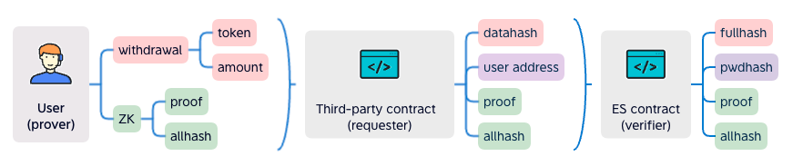

## Abstract
Elastic signature (ES) aims to sign data with a human friendly secret. The secret will be verified fully on-chain and is not stored anywhere. A user can change the secret as often as they need to. The secret does not have a fixed length. The secret will be just like password, which is a better understood concept than private key. This is specifically true for non-technical users. This EIP defines a smart contract interface to verify and authorize operations with ES.


## Motivation
What would a changeable "private key" enable us? For years, we have been looking for ways to lower on-boarding barrier for users, especially those with less technical experiences. Private key custody solutions seem to provide an user friendly on-boarding experience, but it is vendor dependent and is not decentralized. ES makes a breakthrough with Zero-knowledge technology. Users generate proof of knowing the secret and a smart contract will verify the proof. 


## Use case
ES is an alternative signing algorithm. It is not an either-or solution to the private key. It is designed to serve as an additional signing mechanism on top of the private key signature.
- A DeFi app can utilize ES into their transfer fund process. Users will be required to provide their passwords to complete the transaction. This gives an extra protection even if the private key is compromised.
- ES can also be used as a plugin to a smart contract wallet, like Account Abstraction (EIP 4337). A decentralized password is picked instead of the private key. This could lead to a smooth onboarding experiences for new Ethereum Dapp users.


## Specification
The key words "MUST", "MUST NOT", "REQUIRED", "SHALL", "SHALL NOT", "SHOULD", "SHOULD NOT", "RECOMMENDED", "MAY", and "OPTIONAL" in this document are to be interpreted as described in [RFC 2119](https://www.ietf.org/rfc/rfc2119.txt).

There are three parties involved, Verifier, Requester and Prover.

- A verifier, 
  - SHOULD verify the proof given all the public outputs.
  - MUST NOT store password in plain text.
- A requester
  - SHOULD generate a datahash of an operation and its parameters, and provide the datahash to the verifier.
  - SHALL request a verification from the verifier. 
- A prover
  - SHOULD generate the proof the public outputs from the operation hash, well-known variables and the private secret (password). 
    - well-known variable 
      - SHOULD include a nonce from the verifier
      - MAY include an expiration timestamp 
    - public outputs 
      - SHOULD include one reflecting the private secret, pwdhash.
      - SHOULD include one reflecting the operation hash and well-known variables, fullhash.
      - SHOULD include one resulting from pwdhash and fullhash.

Below is the interface that a verifier SHOULD implement.
```javascript
pragma solidity ^0.8.0;

interface IElasticSignature {
    /**
     * An event emitted after user set/reset his password
     * @param user - the password owner (it could be smartcontract wallet address)
     * @param pwdhash - the password hash
     */
    event SetPassword(address indexed user, uint indexed pwdhash);

    /**
     * An event emitted after operation verified with password
     * @param user - the password owner (it could be smartcontract wallet address)
     * @param nonce - each user has a nonce, the nonce will +1 after verified
     */
    event Verified(address indexed user, uint indexed nonce);

    /**
     * Get password hash of user
     * @param user - the password owner (it could be smartcontract wallet address)
     * @return - password hash of user
     */
    function pwdhashOf(address user) external view returns (uint);

    /**
     * User set/reset his password, it will update his pwdhash
     * @param proof1 - proof generated by the old password
     * @param expiration1 - old password signing expiry seconds
     * @param allhash1 - allhash generated by the old password
     * @param proof2 - proof generated by the new password
     * @param pwdhash2 - hash of the new password generated by ZK
     * @param expiration2 - new password signing expiry seconds
     * @param allhash2 - allhash generated by the new password
     */
    function resetPassword(
        uint[8] memory proof1,
        uint expiration1,
        uint allhash1,
        uint[8] memory proof2,
        uint pwdhash2,
        uint expiration2,
        uint allhash2
    ) external;

    /**
     * Verify user's password signing operation.
     * It should be called by another contract, that contract knows the operation params
     *  then generate the datahash to call this function, it will proof that user's password
     *  is correct, and the operation(datahash) is signed by the password
     * @param user - the password owner
     * @param proof - proof generated by the password
     * @param datahash - the data what user signing, this is the hash of the data
     * @param expiration - password signing expiry seconds
     * @param allhash - allhash generated by the password
     */
    function verify(
        address user,
        uint[8] memory proof,
        uint datahash,
        uint expiration,
        uint allhash
    ) external;
}
```

`pwdhashOf` The contract stores everyone's pwdhash (password hash). This function returns user's pwdhash.

`resetPassword` User sets or resets his password, it will update his pwdhash.

`verify` Verify user's password signing operation.

This function should be called by another contract, that contract knows the operation params then generate the datahash to call this function, this function will verify that the operation(datahash) is signed by the correct password.


## Rationale
The contract will store everyone's password hash (`pwdhash`).

<br>
<div align="center"></div>
<br>

ES generates ZK SNARK to show knowing the password.

The chart below shows ZK Circuit logic.

<br>
<div align="center"></div>
<br>

To verify the signature, it needs proof \ allhash \ pwdhash \ fullhash, this is also the ES contract work rationale.

<br>
<div align="center"></div>
<br>

The user operation data, withdrawal data .etc, in front-end ZK circuit, it generates proof and allhash, then send all of them to a third-party contract, that contract can gernerate the datahash, it sends datahash \ proof \ allhash \ user address to ES contract, ES contract verifies that the datahash is from the user, which means the withdrawal data is signed by user's pwd.


## Backwards Compatibility
This EIP is backward compatible with previous work on signature validation since this method is specific to password based signatures and not EOA signatures. 


## Reference Implementation
Example implementation of a signing contract:

```javascript
pragma solidity ^0.8.0;

import "../interfaces/IElasticSignature.sol";
import "./verifier.sol";

contract ZKPass is IElasticSignature {
    Verifier verifier = new Verifier();

    mapping(address => uint) public pwdhashOf;

    mapping(address => uint) public nonceOf;

    constructor() {
    }

    function resetPassword(
        uint[8] memory proof1,
        uint expiration1,
        uint allhash1,
        uint[8] memory proof2,
        uint pwdhash2,
        uint expiration2,
        uint allhash2
    ) public override {
        uint nonce = nonceOf[msg.sender];

        if (nonce == 0) {
            //init password

            pwdhashOf[msg.sender] = pwdhash2;
            nonceOf[msg.sender] = 1;
            verify(msg.sender, proof2, 0, expiration2, allhash2);
        } else {
            //reset password

            // check old pwdhash
            verify(msg.sender, proof1, 0, expiration1, allhash1);

            // check new pwdhash
            pwdhashOf[msg.sender] = pwdhash2;
            verify(msg.sender, proof2, 0, expiration2, allhash2);
        }

        emit SetPassword(msg.sender, pwdhash2);
    }

    function verify(
        address user,
        uint[8] memory proof,
        uint datahash,
        uint expiration,
        uint allhash
    ) public override {
        require(
            block.timestamp < expiration,
            "ZKPass::verify: expired"
        );

        uint pwdhash = pwdhashOf[user];
        require(
            pwdhash != 0,
            "ZKPass::verify: user not exist"
        );

        uint nonce = nonceOf[user];
        uint fullhash = uint(keccak256(abi.encodePacked(expiration, block.chainid, nonce, datahash))) / 8; // 256b->254b
        require(
            verifyProof(proof, pwdhash, fullhash, allhash),
            "ZKPass::verify: verify proof fail"
        );

        nonceOf[user] = nonce + 1;

        emit Verified(user, nonce);
    }

    /////////// util ////////////

    function verifyProof(
        uint[8] memory proof,
        uint pwdhash,
        uint fullhash, //254b
        uint allhash
    ) internal view returns (bool) {
        return
            verifier.verifyProof(
                [proof[0], proof[1]],
                [[proof[2], proof[3]], [proof[4], proof[5]]],
                [proof[6], proof[7]],
                [pwdhash, fullhash, allhash]
            );
    }
}
```

verifier.sol is auto generated by snarkjs, the source code circuit.circom is below

```javascript
pragma circom 2.0.0;

include "../../node_modules/circomlib/circuits/poseidon.circom";

template Main() {
    signal input in[3];
    signal output out[3];

    component poseidon1 = Poseidon(2);
    component poseidon2 = Poseidon(2);

    poseidon1.inputs[0] <== in[0];  //pwd
    poseidon1.inputs[1] <== in[1];  //address
    out[0] <== poseidon1.out; //pwdhash

    poseidon2.inputs[0] <== poseidon1.out;
    poseidon2.inputs[1] <== in[2]; //fullhash
    out[1] <== in[2]; //fullhash
    out[2] <== poseidon2.out; //allhash
}

component main = Main();
```


## Security Considerations
Since the pwdhash is public, it is possible to be crack the password. We estimate the Poseidon hash rate of RTX3090 would be 100Mhash/s, this is the estimate of crack time:

8 chars (number) : 1 secs <br>
8 chars (number + english) : 25 days <br>
8 chars (number + english + symbol) : 594 days <br>

12 chars (number) : 10000 secs <br>
12 chars (number + english) : 1023042 years <br>
12 chars (number + english + symbol) : 116586246 years <br>

The crack difficulty of private key is 2^256, the crack difficulty of 40 chars (number + english + symbol) is 92^40, 92^40 > 2^256, so when password is 40 chars , it is more difficult to be crack than private key.

## Copyright
Copyright and related rights waived via [CC0](../LICENSE.md).