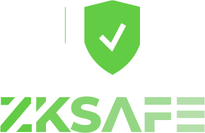

# 🥳 欢迎
 
 

 
 

ZKSAFE开发文档提供零知识证明、智能合约、API的概述

在这里，你可以了解到我们是如何用零知识证明来做安全，以及，如何对接ZKSAFE的基础设施，一起构筑安全的Web3世界

 
 

## 📦️ 模块化
 
我们将产品拆分为各个模块，模块可以独立运行，可以互相组合，还可以和别人家的产品组合，有详细的对接文档，我们的构建宗旨是：

### 让合作伙伴发财！
 
 

## EPS (Ethereum Password Service)
你第一次真正拥有你的密码
 
 

## ZKSAFE
即使私钥被盗，保险箱依然安全
 
 

## 4337 Service (加班研发中)
聚合所有4337钱包的打包服务，大家一起打包更省gas
 
 

## ZKSAFE Pro (加班研发中)
采用ERC4337标准实现个人版的Gnosis-safe
 
 