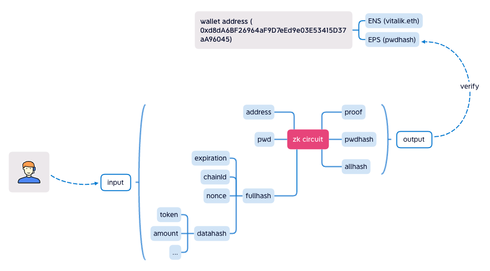

# 📰 How it works
## How Ethereum Password Service(EPS) works 
EPS saves `pwdhash` hash of the password in the contract. ENS is to bind a `name` to an address, our EPS tries to bind `pwdhash` to an address.

<br>
<div align="center"></div>
<br>

We will sign **User actions** with Keccak256 to produce `datahash`. With `expiration`, `chainId`, an auto-incrementing `nonce` and the `datahash`, we will sign them again with Keccak256 to produce `fullhash`. `nonce` is used to avoid the multiple submission attempts.

In a ZK circuit，we use Poseidon algorithm to produce hash. The algorithm is chose as it requires a low gas fee.

The circuit is shown below.

```javascript
pragma circom 2.0.0;

include "../../node_modules/circomlib/circuits/poseidon.circom";

template Main() {
    signal input in[3];
    signal output out[3];

    component poseidon1 = Poseidon(2);
    component poseidon2 = Poseidon(2);

    poseidon1.inputs[0] <== in[0];  //pwd
    poseidon1.inputs[1] <== in[1];  //address
    out[0] <== poseidon1.out; //pwdhash

    poseidon2.inputs[0] <== poseidon1.out;
    poseidon2.inputs[1] <== in[2]; //fullhash
    out[1] <== in[2]; //fullhash
    out[2] <== poseidon2.out; //allhash
}

component main = Main();
```

The chart below shows the logic.

<br>
<div align="center"></div>
<br>

`password` and `address` are first combined to produce `pwdhash`. With the use of `address`, it guarantees the `pwdhash` will be different even if the passwords are the same. 

`pwdhash` and `fullhash` give us `allhash`. It covers all the user actions we want to verify.

At last, `proof` will show `allhash`, `pwdhash` and `fullhash` are all generated via the circuit. Without know what `password` is, we know that `pwdhash` is produced by `password`. As well as `allhash` and `fullhash`, we can be sure that only people knowing what the `password` is produce the hashes and give the proof for them.

`fullhash` as the output will prevent any unwanted modification.


>Poseidon requires 254 bits input data, but Keccak256 consume 256 bits. We will `fullhash` right shift 3 bits.

<br>

### Notes
EPS system only provide password change action for the user. We can verify the password with `pwdhash` off chain. On chain, EPS can be used as signature verification. For example, in ZKSAFE contract, ZKSAFE will use **user actions** to produce `datahash`. It will be passed to EPS for verification. After the **user actions** being verified, ZKSAFE knows whoever knows the password wants to perform these **user actions**.
<br>
