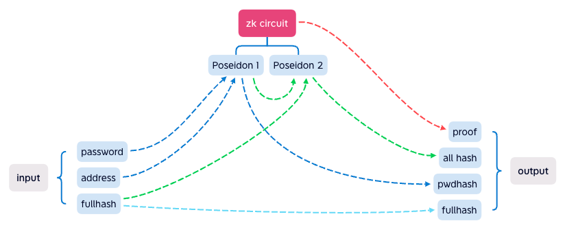

# 📰 工作原理
## ZKSAFE Password 工作原理
ZKPass *（ZKSAFE Password简称ZKPass）* 本质上是把`pwdhash`（密码的哈希值）存在合约里，如果说ENS是把`name`绑定到地址，那么ZKPass就是把`pwdhash`绑定到地址

<br>
<div align="center"></div>
<br>

为了实现签名，需要把 **用户想要干什么** 这个信息，用Keccak256生成`datahash`，再跟签名过期时间`expiration`、指定的链`chainId`、从1开始自增的`nonce`，用Keccak256生成`fullhash`

>为什么用nonce？
>
>用来确保签名不能重复提交，避免双花

在ZK电路里，使用Poseidon算法来生成hash（gas较低的hash算法），代码如下：

```javascript
pragma circom 2.0.0;

include "../../node_modules/circomlib/circuits/poseidon.circom";

template Main() {
    signal input in[3];
    signal output out[3];

    component poseidon1 = Poseidon(2);
    component poseidon2 = Poseidon(2);

    poseidon1.inputs[0] <== in[0];  //pwd
    poseidon1.inputs[1] <== in[1];  //address
    out[0] <== poseidon1.out; //pwdhash

    poseidon2.inputs[0] <== poseidon1.out;
    poseidon2.inputs[1] <== in[2]; //fullhash
    out[1] <== in[2]; //fullhash
    out[2] <== poseidon2.out; //allhash
}

component main = Main();
```

画成逻辑图就是下图

<br>
<div align="center"></div>
<br>

`password`和`address`生成`pwdhash`，确保每个用户的`pwdhash`都不一样

`pwdhash`和`fullhash`生成`allhash`，确保所有的数据都有带上

最后`proof`就相当于给`allhash`、`pwdhash`、`fullhash`盖了个章，证明`pwdhash`是由`password`生成的，但是不知道`password`是啥，也证明了`allhash`是由`password`和`fullhash`生成

`fullhash`作为输出，在合约里可以验证是否被篡改（即签名）

>听起来像绕口令？
>
>是的，还有一个坑没说，Poseidon算法的输入是254位，但是Keccak256生成的`fullhash`是256位，所以需要`fullhash`除以8再输入到ZK电路，ZKPass合约已经自动除以8了，需要前端也除以8，这样才能在ZKPass合约校验通过

<br>

### 补充说明
在用户侧，ZKPass只有改密码的功能，如果只是验证密码，获取`pwdhash`在链下就可以验证，而链上的验证通常是配合其他合约一起，做数据签名用，比如ZKSAFE合约：ZKSAFE合约把 **用户想要干什么** 这些参数，在合约内生成`datahash`传给ZKPass合约，ZKPass验证成功后，ZKSAFE合约就知道用户的密码正确，以及 **用户想要干什么** 这些参数没有被篡改（即签名），ZKSAFE合约就可以做下一步（提币）操作了
<br>
