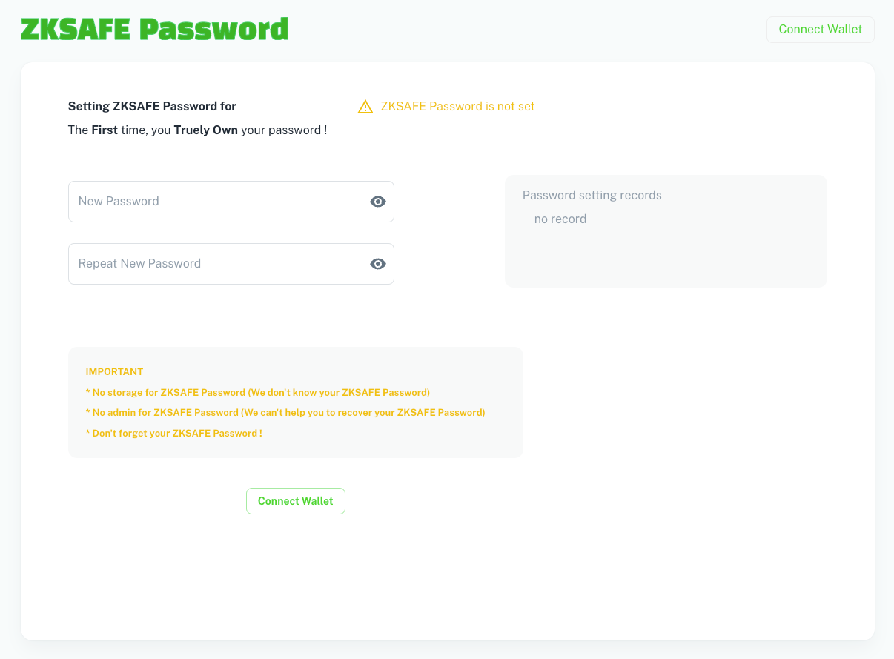
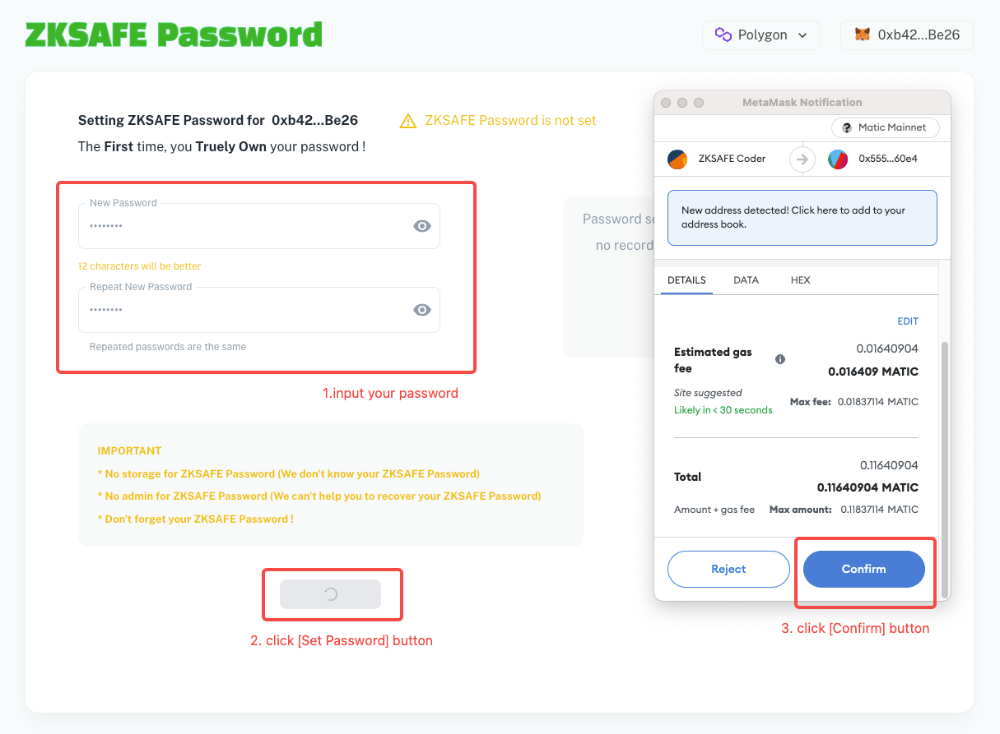
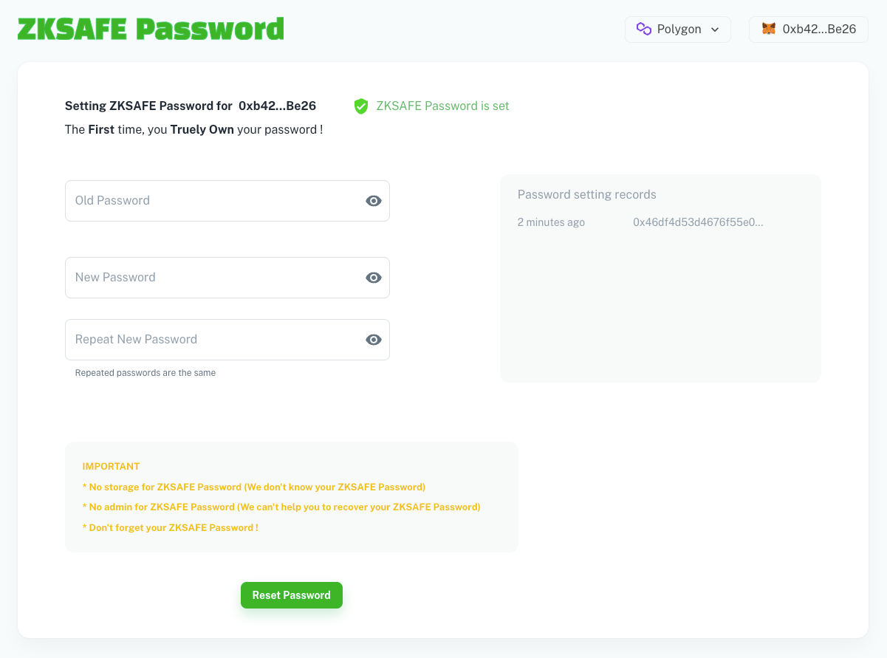

# 📚 教程
## ZKSAFE Password 说明
ZKPass *（ZKSAFE Password简称ZKPass）* 只有两个功能：
1. 设置密码
2. 验证签名 

其中，验证签名对接的是其他项目的合约，比如ZKSAFE合约。而设置密码在ZKSAFE插件中也有实现。为了对接更多的项目，ZKPass作为一个独立子项目，开发了ZKPass网页端，可以不依赖ZKSAFE插件，也能让合作方更好理解ZKPass协议级的运行方式

ZKPass的密码和ZKSAFE插件的密码是同一个

简而言之，ZKPass是to B，ZKSAFE是to C
 
 

### 使用教程
打开网站 https://password.zksafe.pro/ ，点击Connect Wallet按钮，连接MetaMask钱包
 

 

输入两次相同的密码后，点击Set Password按钮，电脑进入ZK计算，需要等待loading几秒到10几秒时间（根据你电脑的性能），电脑计算完ZK后，弹出MetaMask确认框，再点击确认按钮，等待链上确认即可
 

 

如果你设置过密码，那么你打开ZKPass就是重置密码页面，还可以查看最近的设置密码记录
 

 

需要用旧密码才能重置新密码
 
 

### 关于密码（非常重要）
关于密码你需要知道的几点，不要出事了才来看
* ZKPass没有存储你的密码，没有人知道你的密码，除了你自己
* ZKPass没有管理员，没有人能帮助你找回密码或重置密码
* 不要忘记你的密码，不要记在电脑或手机上，记在纸上

我们没法阻止密码破解，关于密码强度
* 6位密码可以在10天内破解，所以不能设置这么短
* 8位密码破解现在需要几十年，随着电脑性能发展，未来可能只需要几个月
* 建议12位以上密码，可以是一个短句子+数字，比如 *2022IHaveADreamToday*