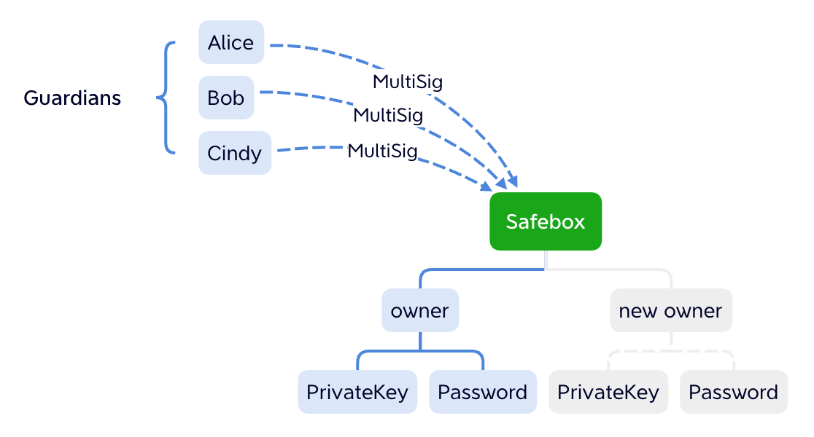
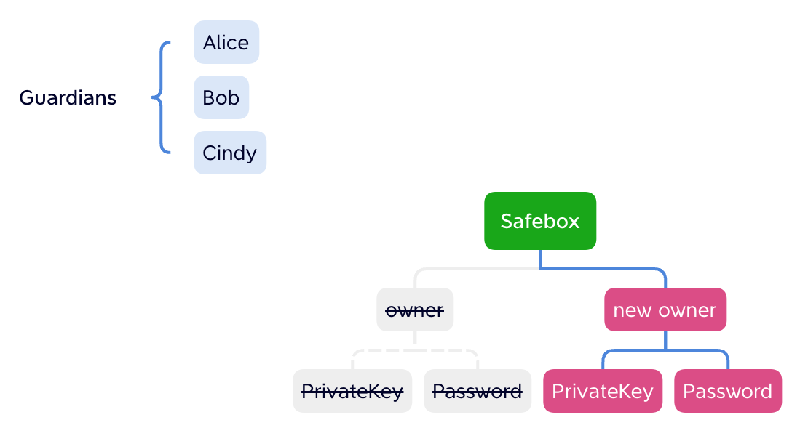

# 👋 介绍
## ZKSAFE
我们创建了一种要用[EPS密码](../eps/README.md)+私钥才能打开的保险箱，**即使私钥被盗，资产依然安全**

每个用户都可以拥有一个自己的保险箱合约，它是你的私人银行，只为你一个人服务，如果你的私钥和密码忘记了，它可以通过社交恢复帮你重置

无需购买硬件，只需安装ZKSAFE浏览器插件，点击[这里]领取你的私人银行
 
 

## 保险箱和钱包
生活中，我们不会把太多的钱放购物卡/公交卡，只把零钱放进去，而大部分的钱都是存银行，跟这个现实类似：

少部分钱，即热资产存钱包，可以去转账，去DEFI

大部分钱，即冷资产存保险箱，安全第一

ZKSAFE插件是钱包的安全伴侣，以MetaMask为例

* MetaMask 处理你的私钥

* ZKSAFE 处理你的密码

ZKSAFE不存储用户的私钥，也不存储用户的密码，提款流程见下图

在提款的时候，先弹出ZKSAFE确认框，输入密码，ZKSAFE通过你的密码计算出ZK-SNARK Proof，并调出MetaMask确认框，通过MetaMask进行私钥签名上链
 

### ZKSAFE的密码和MetaMask的密码有什么区别
完全不同的体系，MetaMask不直接存储你的私钥，而是存储了你私钥的证书，打开MetaMask时候输入的密码，其实是证书的密码，目的是导出私钥。如果证书丢失（比如重装系统），密码就导不出私钥，资产就取不出来；如果私钥被盗，黑客不需要密码，也能盗走资产。证书+密码是用来避免直接存储私钥，从而避免私钥被木马盗取

ZKSAFE的密码是[EPS密码](../eps/README.md)，是你账户的另一个密码。这个密码存储在智能合约里，通过零知识证明加密，除了你自己，没人能改你的密码。密码永远在线，你是换了台电脑，密码依然有效；即使EPS倒闭，密码依然有效；只要以太坊不倒，[EPS密码](../eps/README.md)不倒。如果私钥被盗，黑客不知道[EPS密码](../eps/README.md)，也就盗不走资产
 

### 资产存放在哪里
如图所示

钱包可以拥有资产，每个钱包也可以拥有一个自己的ZKSAFE合约。

资产可以放在钱包，用私钥就可以转移；资产可以存到自己的ZKSAFE合约，也可以存到别人的ZKSAFE合约。从ZKSAFE合约取出资产需要同时满足3点：

1. 用户（钱包）只能调用自己的ZKSAFE合约，不能调用别人的ZKSAFE合约
2. 输入正确的EPS密码
3. 不能提到任意地址，只能提到用户自己的钱包地址

这保证了：

1. 没有资金池，DEFI通常把大家的钱都放一个资金池里，只要资金池被盗，所有人都被盗
2. 私钥被盗，没有密码，黑客也取不出钱
3. 没有授权或转错之类的问题，每一笔转出都是转到用户自己的钱包

 
 

## 安全性
正确的使用ZKSAFE才能保护你的资产安全，不要出事了才跑来看这章

### 资产安全性
ZKSAFE的资产安全性有以下3种可能：

1. 私钥泄漏，密码不泄漏，资产安全
2. 密码泄漏，私钥不泄漏，资产安全
3. 私钥泄漏，密码也泄漏，资产不安全

>**强烈建议**：密码怕忘记可以记在纸上，千万不要放在手机或电脑里，千万不要在EPS和ZKSAFE以外的地方输入密码，防止密码泄漏

 

### 密码安全性
ZKSAFE不存储你的密码，也没有办法替你改密码，如果你密码忘记，只有事先设置好的社交恢复能帮到你

合作方如果希望校验用户的密码，可以调用ZKSAFE插件，弹出ZKSAFE密码输入框，ZKSAFE校验后将密码生成的所有参数（不包括密码）返回给合作方网站，密码不出插件，确保安全

>**特别注意**：过于简单的密码，比如6位数字，9天之内可以破解；8位数字+英文，当下硬件需要上百年破解；但考虑到硬件的进步，我们建议12位大小写+数字+符号。在新硬件出现前，我们会升级EPS密码算法，以确保12位密码的安全

 

### 社交恢复
如果忘记密码或私钥，可以通过事先设置的守护者们发起多签（无需密码）来社交恢复

保险箱的所有权转移，新拥有者的密码和私钥替代旧的

守护者可以是你最信任的亲人朋友，也可以是你自己的其他钱包。为保障安全，不要让守护者钱包都在同一台设备上。

守护者还可以是Gnosis-safe多签钱包，这个对接我们正在做

转移保险箱所有权，除了守护者多签，密码+私钥也可以转移，如果你觉得自己的私钥或密码已泄漏，可以用这种方式转移到新的钱包

转移保险箱需要额外的手续费

>**强烈建议**：ZK-SNARK的成熟度需要时间检验，不排除密码失效导致资产无法提出的可能，为了避免这种可能，强烈建议每个用户都设置社交恢复

