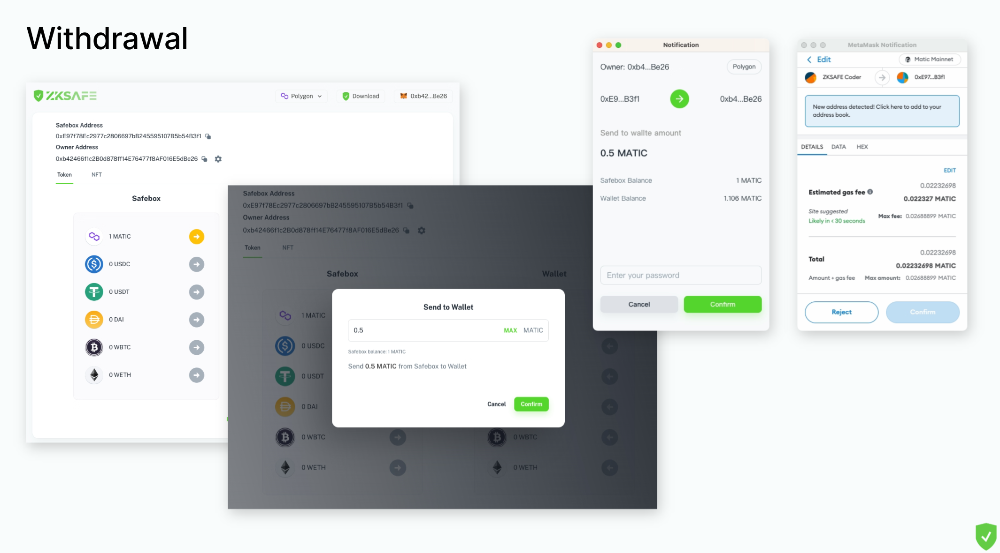

# 👋 介绍
## ZKSAFE
我们创建了一种要用[EPS密码](../eps/README.md)+私钥才能打开的保险箱，**即使私钥被盗，资产依然安全**

每个用户都可以拥有一个自己的保险箱合约，它是你的私人银行，只为你一个人服务，如果你的私钥和密码忘记了，它可以通过社交恢复帮你重置

无需购买硬件，只需安装ZKSAFE浏览器插件，点击[这里]领取你的私人银行
 
 

## ZKSAFE和钱包的关系

ZKSAFE是钱包的安全伴侣，以MetaMask为例

* MetaMask 处理你的私钥

* ZKSAFE 处理你的密码

ZKSAFE不存储用户的私钥，也不存储用户的密码，提款流程见下图

 

 

在提款的时候，先弹出ZKSAFE确认框，输入密码，ZKSAFE通过你的密码计算出ZK-SNARK Proof，并调出MetaMask确认框，通过MetaMask进行私钥签名上链
 

### ZKSAFE的密码和MetaMask的密码有什么区别
完全不同的体系，MetaMask不直接存储你的私钥，而是存储了你私钥的证书，打开MetaMask时候输入的密码，其实是证书的密码，目的是导出私钥。如果证书丢失（比如重装系统），密码就导不出私钥；如果私钥被盗，资产就被盗。证书+密码是用来避免直接存储私钥，从而避免私钥被木马盗取

ZKSAFE的密码是[EPS密码](../eps/README.md)，是你账户的另一个密码。这个密码存储在智能合约里，通过零知识证明加密，除了你自己，没人能改你的密码。密码永远在线，你是换了台电脑，密码依然有效；即使EPS倒闭，密码依然有效；只要以太坊不倒，[EPS密码](../eps/README.md)不倒。
 

### 资产存放在哪里
如图所示

 

 

钱包可以拥有资产，每个钱包也可以拥有一个自己的ZKSAFE合约。

资产可以放在钱包，用私钥就可以转移；资产可以存到自己的ZKSAFE合约，也可以存到别人的ZKSAFE合约。从ZKSAFE合约取出资产需要同时满足3点：

1. 用户（钱包）只能调用自己的ZKSAFE合约，不能调用别人的ZKSAFE合约
2. 输入正确的EPS密码
3. 不能提到任意地址，只能提到用户自己的地址

这充分保证了：

1. 没有资金池，DEFI通常把大家的钱都放一个资金池里，所以资金池被盗，所有人都被盗
2. 私钥被盗，没有密码，黑客也取不出钱
3. 没有授权之类的问题，打消用户顾虑

 
 

## 资产安全性
ZKSAFE的安全性有以下3点：

1. 私钥泄漏，密码不泄漏，资产安全
2. 密码泄漏，私钥不泄漏，资产安全
3. 私钥泄漏，密码也泄漏，资产不安全

