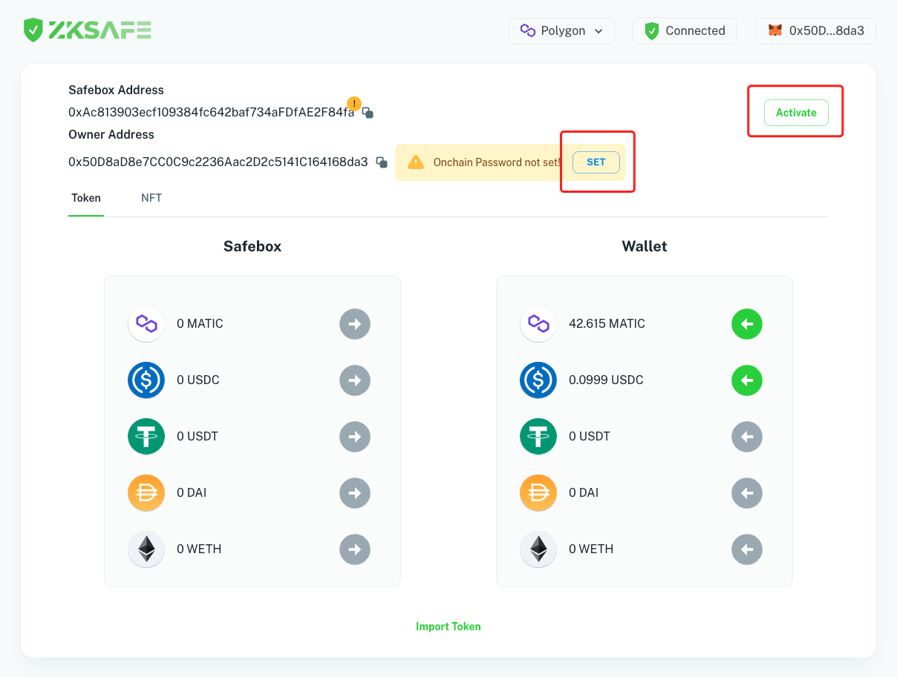
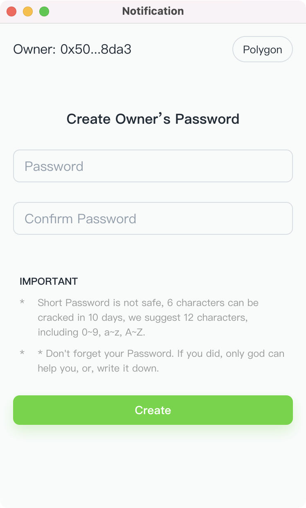
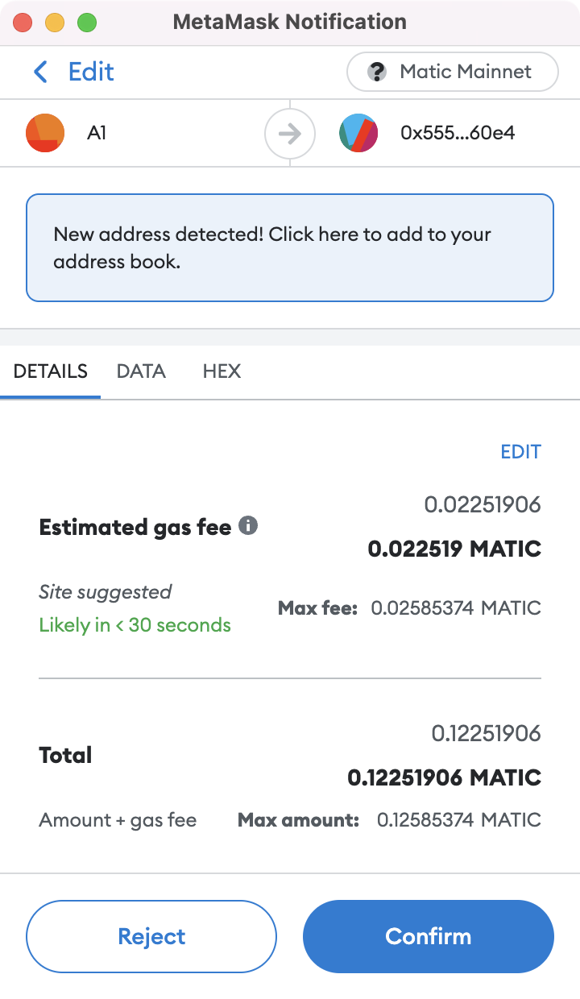

# 📚 教程
## ZKSAFE 说明

ZKSAFE是开源免费的，协议级的安全产品，使用链上密码+私钥的多签来保护资产：
* 私钥被盗，密码还在，资产安全
* 密码被盗，私钥还在，资产安全
* 密码被盗，私钥被盗，资产不安全

需要安装ZKSAFE插件和MetaMask插件，一个管密码，另一个管私钥

核心功能有3个：
1. 设置密码
2. 存取资产
3. 社交恢复

ZKSAFE是协议级的，没有后台，没有私钥托管，没有管理员

ZKSAFE是钱包的安全伴侣，也是你的私人银行。钱包放零钱，大资金放ZKSAFE，安全第一，需要用时再从ZKSAFE提到钱包

一句话说明ZKSAFE：**即使私钥被盗，资产依然安全**
 
 

### 使用教程
打开网站 https://app.zksafe.pro/ 
* 点击`Download`按钮，跳转到Chrome应用商店下载ZKSAFE插件，安装后`Download`变成`Connected`表示ZKSAFE插件连接成功
* 点击`Connect Wallet`按钮，连接MetaMask钱包
 

 

新用户需要先激活保险箱，点击`Activate`按钮，弹出MetaMask确认框，再点击`确认`按钮，部署一个你专有的Safebox智能合约。上链后，`Safebox Address`即刚部署的Safebox智能合约地址，以后你可以直接给这个地址转Token和NFT，只有你能取出来
 

 

取出资产必须要有链上密码，点击`SET`按钮，在ZKSAFE插件弹出框中创建你的链上密码。等待几秒到10几秒时间（根据你的电脑性能），然后在弹出的MetaMask确认框中点击`确认`按钮。
 

 

上链后，`Owner Address`即你的钱包地址，以后只能这个钱包才能取出保险箱资产

>一个钱包只能创建一个保险箱，一个钱包也只能创建一个链上密码
>链上密码不是保险箱的密码，而是钱包的链上密码，可通过社交恢复把保险箱转给另一个钱包，从而转移保险箱内的全部资产（详见社交恢复）

 
 

### 存取资产
激活保险箱和创建链上密码后，你就可以在保险箱和钱包之间来回转移资产了

#### 存入
点击`绿色箭头`按钮，在弹出框中输入Token数量，点击`Confirm`按钮，弹出MetaMask确认框，点击`确认`等待上链即可

你也可以通过其他钱包给你的`Safebox Address`转Token

 
 