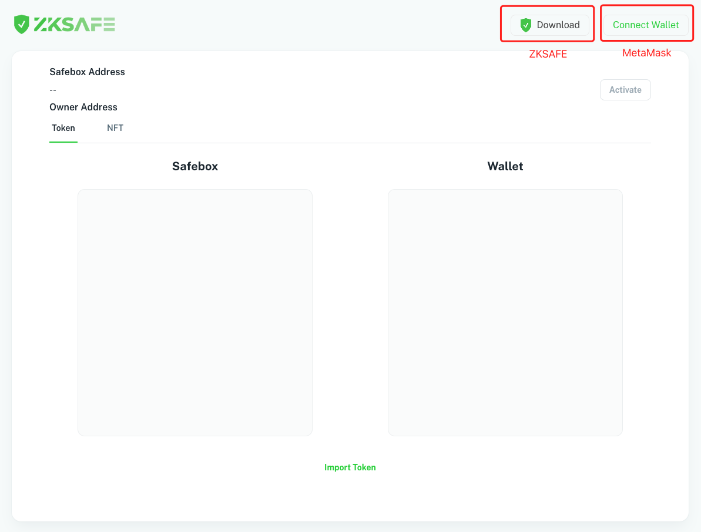
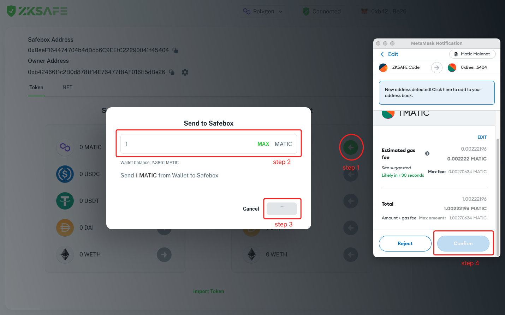

# 📚 Tutorial
## About ZKSAFE

ZKSAFE is an open source, free, protocol-level security product that uses on-chain password + private key multiple signing to protect assets:
* Private key is hacked, password is safe, and your assets are safe
* Password is cracked, private key is safe, and your assets are safe
* Password is cracked, private key is hacked, your assets are not safe

You need to install the ZKSAFE Dapp and MetaMask Dapp, one for the password and the other for the private key

There are three core functions:
1. Set password
2. Deposit/withdraw tokens
3. Social Recovery 

ZKSAFE is protocol level products with no backend, no private key hosting, and no administrator

ZKSAFE is a security partner of your wallet and your personal bank. You can save your exchanges in Wallet, large funds in ZKSAFE, and transfer them from ZKSAFE to wallet because safety first

In one word: **with ZKSAFE, even if the private key is stolen, the asset remains safe**
 
 

### Tutorial
Open Dapp https://app.zksafe.pro/ 
* Click on `Download` button to download ZKSAFE Extension in google chrome APP store, `Connected` will replace the `Download` button after connecting ZKSAFE Dapp
* Click on `Connect Wallet` to connect MetaMask
 

 

New users will need to Activate safebox first, click the `Activate` button, and the `confirm` button when MetaMask confirmation box popped up, to deploy your proprietary Safebox smart contracts. And then `Safebox Address` will appear, which is the deployed contract address by ZKSAFE, You can transfer Token and NFT to this address, only you can transfer them out
 

 

You must have on-chain password to withdraw the asset. Click the `SET` button and create your on-chain password in the ZKSAFE Extension pop-up. Wait a few seconds (depending on your computer performance), then click the `Confirm` button in the MetaMask confirmation box that popped up

 

`Owner Address` is your wallet address and you can transfer out your safebox assets from this address after depoyed on-chain

>One wallet can only create one safebox, and vice versa
>
>The on-chain password s not the safebox’s password, but the wallet's. The safebox can be transferred to another wallet through social recovery, to transfer all the assets in the safebox (see Social Recovery for details)

 
 

### Deposit & Withdrawal
You can transfer assets between the safebox and wallet after safebox is active and password is set

#### Deposit
Click the `green arrow` button, enter the tokens `amount` in the pop-up box, click `Confirm` button after MetaMask confirmation box popped up, then waiting for on-chain process

You can also transfer your tokens to your `Safebox Address` from another wallet
 

#### Withdrawal
Click the `orange arrow` button, enter the token `amount` in the pop-up box, click `Confirm` button, then enter the `password` when ZKSAFE confirmation box popped up, click `Confirm` after MetaMask confirmation box popped up wait for on chain data

Due to security restrictions, you cannot transfer your assets to any address but only `Owner address`, to avoid wrong operations
 

 
ZKSAFE supports the transfer of NFT（ERC721）besides tokens (ERC20), other asset types (such as ERC1155) are not supported for now
 
 

### Social Recovery
If you forget the password or private key, you can transfer ownership of the safebox to your other new wallet, so you can use the new wallet's on-chain password + private key to withdraw the assets

 

There are 2 ways for transferring the ownership of the safebox:
1. Set multi-signing wallet ahead, which can be your cold wallet or your friend’s wallet, to initiate multi-signing 
2. Use your on-chain password and your private key

The original wallet will be invalid after your transferring the ownership of the safebox to new wallet

>**Reminding**：ZK-SNARK is still need time for testing, and we could exclude the possibility of assets loss caused by password issues, so it’s strongly suggested that each user can set the multi-signing

 
 